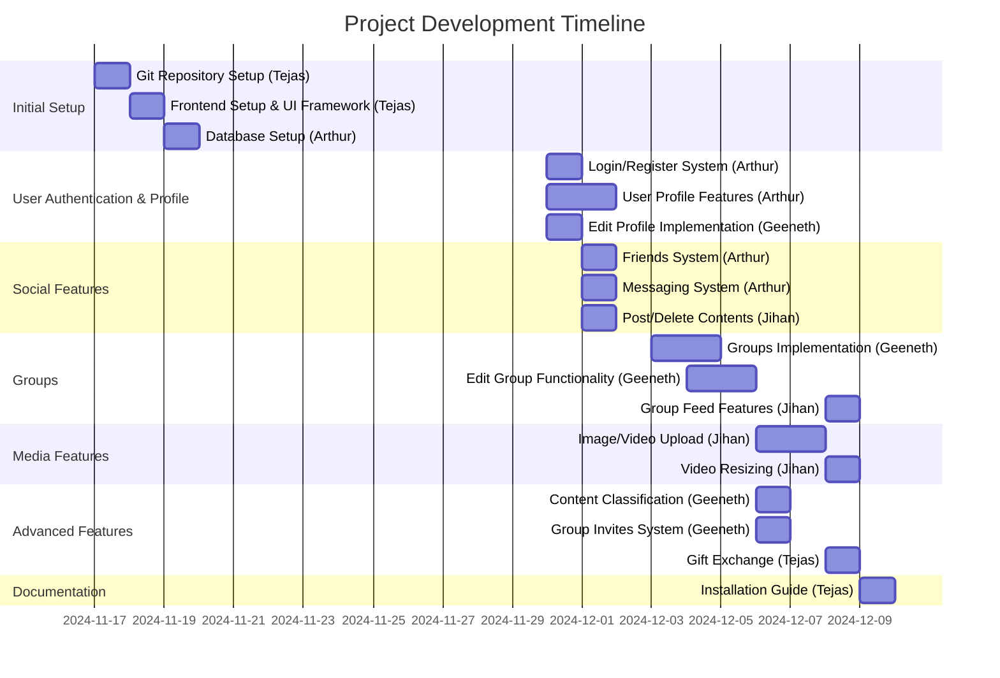

# Project Timeline

```mermaid
gantt
    title Project Development Timeline
    dateFormat YYYY-MM-DD
    
    section Initial Setup
    Git Repository Setup (Tejas)          :2024-11-17, 1d
    Frontend Setup & UI Framework (Tejas)  :2024-11-18, 1d
    Database Setup (Arthur)                :2024-11-19, 1d
    
    section User Authentication & Profile
    Login/Register System (Arthur)         :2024-11-30, 1d
    User Profile Features (Arthur)         :2024-11-30, 2d
    Edit Profile Implementation (Geeneth)  :2024-11-30, 1d
    
    section Social Features
    Friends System (Arthur)                :2024-12-01, 1d
    Messaging System (Arthur)              :2024-12-01, 1d
    Post/Delete Contents (Jihan)          :2024-12-01, 1d
    
    section Groups
    Groups Implementation (Geeneth)        :2024-12-03, 2d
    Edit Group Functionality (Geeneth)     :2024-12-04, 2d
    Group Feed Features (Jihan)            :2024-12-08, 1d
    
    section Media Features
    Image/Video Upload (Jihan)            :2024-12-06, 2d
    Video Resizing (Jihan)                :2024-12-08, 1d
    
    section Advanced Features
    Content Classification (Geeneth)       :2024-12-06, 1d
    Group Invites System (Geeneth)        :2024-12-06, 1d
    Gift Exchange (Tejas)                 :2024-12-08, 1d
    
    section Documentation
    Installation Guide (Tejas)            :2024-12-09, 1d
```